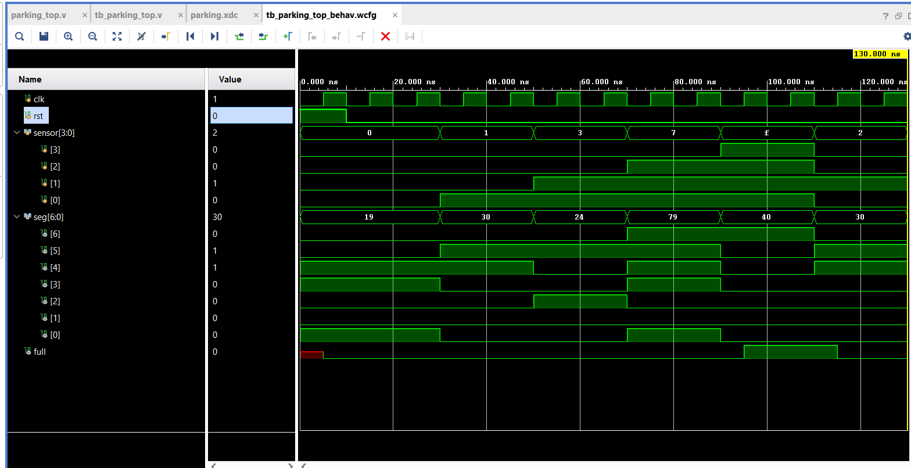
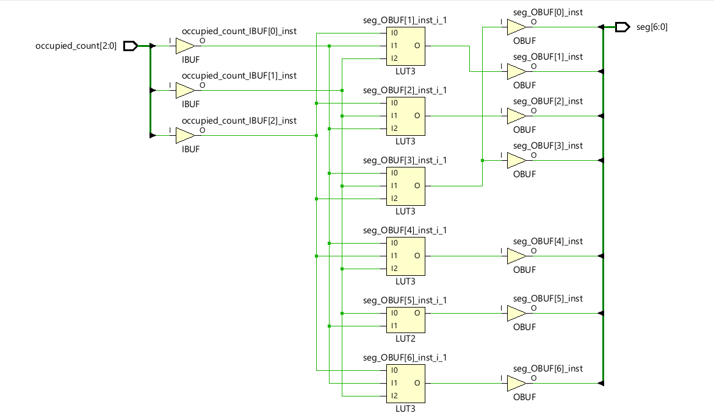
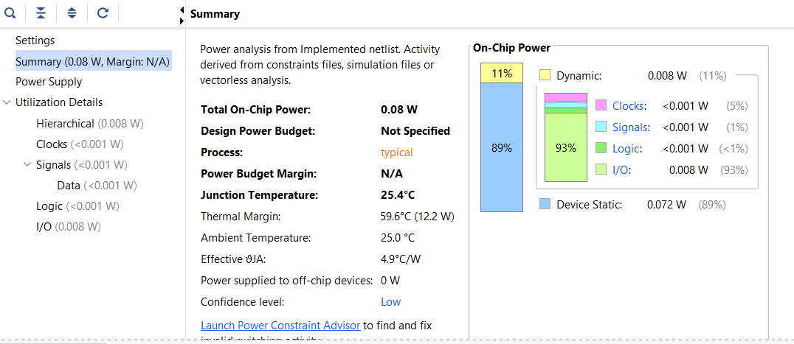
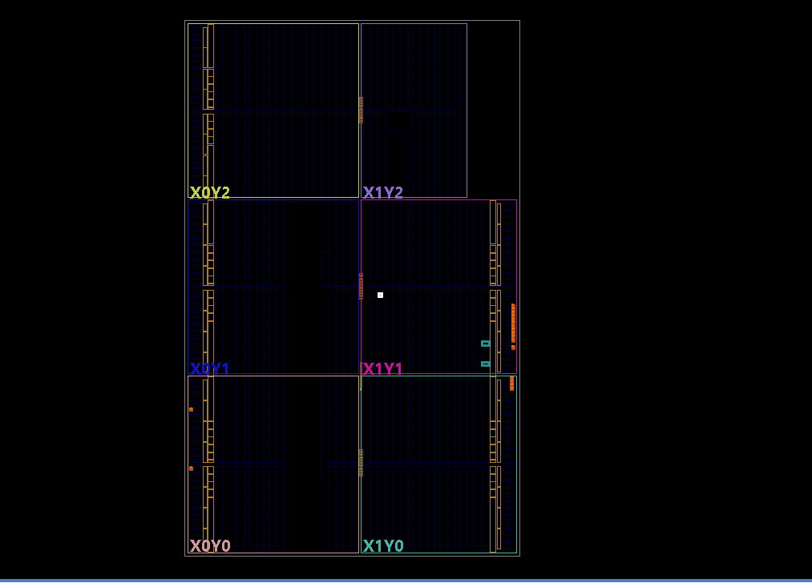

# Smart Parking Controller on FPGA 🚗

> 🏆 **2nd Place Winner – Hacktronics 2.0 (36-Hour National VLSI Hackathon)**  
> Developed and deployed a Smart Parking Controller on a **Nexys4 DDR (Artix-7 FPGA)** using Verilog HDL and Xilinx Vivado.

---

## 📌 Project Overview

The Smart Parking Controller is an FPGA-based digital system designed to monitor parking occupancy in real time and indicate parking status through onboard LEDs and a 7-segment display.

The project was developed during **Hacktronics 2.0**, a 36-hour VLSI-focused hackathon, where the primary objective was to create an optimized hardware solution with low resource utilization, low power consumption, and successful FPGA deployment.

Unlike software-based parking systems, this design executes entirely in hardware, enabling deterministic and real-time operation.

---

## 🎯 Problem Statement

Traditional parking systems often rely on software controllers and microprocessors, introducing unnecessary latency and computational overhead.

This project demonstrates how a lightweight FPGA architecture can:

- Monitor parking slot occupancy in real time
- Calculate occupied slots instantly
- Detect parking full conditions
- Display occupancy count on a 7-segment display
- Operate with extremely low resource utilization and power consumption

---

## 🏗 System Architecture

```text
Sensor Inputs [3:0]
          │
          ▼
     Popcount Module
          │
          ▼
   Occupancy Counter
          │
          ▼
     FSM Controller
          │
          ├── Full Indicator LED
          │
          ▼
    Display Driver
          │
          ▼
     7-Segment Display
```

---

## 📂 RTL Modules

### 1. parking_top.v
Top-level integration module connecting all RTL blocks.

### 2. popcount.v
Counts the number of occupied parking slots.

Example:

```text
Sensor = 1011
Occupied Count = 3
```

### 3. fsm_controller.v
Finite State Machine responsible for parking status detection.

States:

```text
NOT_FULL
FULL
```

### 4. display_driver.v
Converts occupancy count into 7-segment display outputs.

---

## 🧪 Functional Verification

The design was verified using a custom Verilog testbench in Xilinx Vivado.

### Simulation Waveform



The waveform confirms:

- Correct occupancy detection
- Accurate count generation
- Proper FSM transitions
- Correct display outputs

---

## ⚙️ FPGA Implementation Flow

The complete RTL-to-hardware workflow was performed using Xilinx Vivado:

1. RTL Design
2. Behavioral Simulation
3. Synthesis
4. Implementation
5. Placement & Routing
6. Power Analysis
7. Bitstream Generation
8. Hardware Deployment on Nexys4 DDR

---

## 📊 Resource Utilization

### Post-Synthesis Results



#### Resource Summary

| Resource | Utilization |
|-----------|------------|
| LUTs | 4 |
| Registers | 1 |
| DSP Blocks | 0 |
| BRAM | 0 |

### Key Observation

The complete parking controller was implemented using only:

- **4 LUTs**
- **1 Flip-Flop**

demonstrating an extremely lightweight FPGA architecture.

---

## 🔋 Power Analysis

### Vivado Power Report



### Measured Results

| Metric | Value |
|----------|---------|
| Total On-Chip Power | 0.08 W |
| Dynamic Power | 0.008 W |
| Static Power | 0.072 W |
| Junction Temperature | 25.4°C |
| Thermal Margin | 59.6°C |

### Dynamic Power Breakdown

| Component | Contribution |
|------------|------------|
| I/O | 93% |
| Clocks | 5% |
| Signals | 1% |
| Logic | <1% |

### Key Insight

The logic consumed less than:

```text
0.008 Watts
```

indicating highly optimized combinational and sequential logic implementation.

---

## 🗺 FPGA Floorplanning

### Placement & Routing View



Post-implementation floorplanning generated by Vivado showing successful placement and routing on the Artix-7 FPGA fabric.

---

## 🎥 Hardware Demonstration

The design was successfully programmed and validated on a:

```text
Nexys4 DDR FPGA Development Board
```

### Hardware Validation Video

📹 [Hardware Execution](./Proofs/Hardware_Execution.mp4)

Verified Features:

- Real-time occupancy detection
- Correct parking count display
- Full condition indication
- Stable FPGA operation

---

## 🏆 Hackathon Achievement

### Hacktronics 2.0

- Duration: 36 Hours
- Domain: VLSI & FPGA Design
- Platform: Nexys4 DDR (Artix-7 FPGA)

### Result

🥈 **2nd Place Winner**

### Certificate


---

## 🚀 Skills Demonstrated

### Hardware Design

- Verilog HDL
- RTL Design
- FSM Design
- Combinational Logic
- Sequential Logic

### FPGA Development

- Xilinx Vivado
- Synthesis
- Implementation
- Floorplanning
- Timing Analysis
- Power Analysis

### Verification

- Testbench Development
- Functional Simulation
- Waveform Analysis

### Hardware Deployment

- Bitstream Generation
- FPGA Programming
- Hardware Validation

---

## 📈 Project Highlights

✅ 2nd Place at a National-Level VLSI Hackathon

✅ Complete RTL → FPGA Deployment Flow

✅ Successfully Deployed on Nexys4 DDR FPGA

✅ Only 4 LUTs and 1 Register Utilized

✅ Total On-Chip Power Consumption of 0.08 W

✅ Dynamic Logic Power of Only 0.008 W

✅ Hardware-Validated Real-Time Operation

---

## 👨‍💻 Author

**Daksh Mavani**

Electronics & Communication Engineering  
FPGA • VLSI 

LinkedIn: *https://www.linkedin.com/in/daksh-mavani/*
